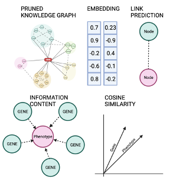
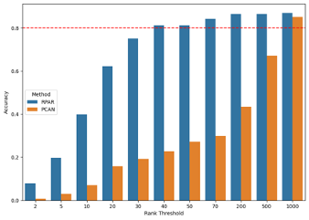

# RPAR
The Rank order prediction of genes for a given set of phenotypes for mendelian and rare disease framework (RPAR) 

# Methods
The Rank order prediction of genes for a given set of phenotypes for mendelian and rare disease framework (RPAR) prioritizes candidate diagnostic-relevant genes for genetics conditions, leveraging a large-scale clinical knowledge graph (CKG) consisting of 19,405,058 nodes and 217,341,612 edges as relationships, curated from 24 databases and ten ontology data sources such as the Human Phenotype Ontology. The entire CKG is stored in a Neo4j graph data platform for easy querying, visualization, and computations. The developed framework includes two major ML modules: (i) prediction of reliable knowledge relationships using a graph embedding approach FastRP (Fast Random Projection), and (ii) gene-phenotype relevance ranking according to the Cosine similarity of gene and phenotype nodes in CKG, using the predictions and information content for each phenotype as weights. Multiple ML strategies were compared and optimized for both modules.

# Results
Comparing the results with industy standard PCAN, we find that RPAR outperfoms PCAN on a rare disease cohort from Service-Line (SL-1) group from Mayo Clinic

# Presentation
A clinical knowledge graph-based machine learning framework to prioritize candidate genes for facilitating diagnosis of Mendelian diseases and rare genetic conditions. \
R Gnanaolivu, G Oliver, G Jenkinson, N Chia, E Klee, C Wang, American Society of Human Genetics, 2023

