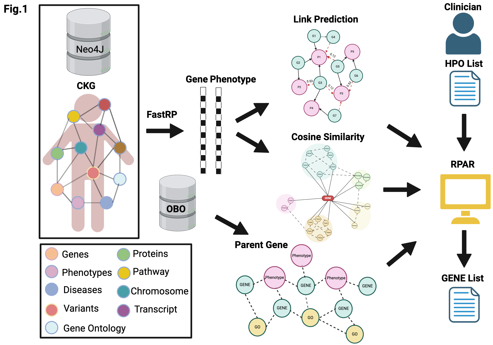
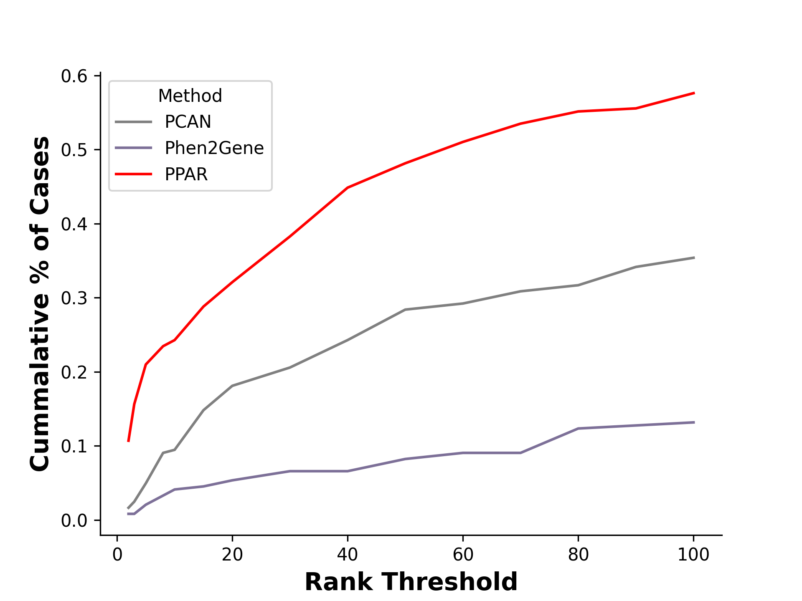

# PPAR

**PPAR** (Rank Prediction and Analysis of Genes for Mendelian and Rare Disease Framework) is a machine learning-based framework designed to prioritize candidate genes for diagnosing Mendelian and rare genetic conditions. The framework leverages a large-scale clinical knowledge graph (CKG) and applies graph embedding and ranking algorithms to identify diagnostic-relevant genes based on phenotypic information.

## Methods

The PPAR framework integrates clinical knowledge from multiple sources, including 19,405,058 nodes and 217,341,612 edges, curated from 24 databases and ten ontologies (e.g., Human Phenotype Ontology). This data is stored and processed within a Neo4j graph data platform, enabling efficient querying, visualization, and computation. RPAR consists of two primary machine learning modules:

1. **Prediction of Knowledge Relationships**: Uses FastRP (Fast Random Projection), a graph embedding approach, to predict reliable relationships within the CKG.
2. **Gene-Phenotype Relevance Ranking**: Prioritizes genes based on the Cosine similarity between gene and phenotype nodes, using phenotype information content as weights. Various machine learning strategies were optimized and compared for both modules.
3. **Parent gene analysis using a custom GO-Gene-Phenotype graph



## Results

PPAR was benchmarked against industry-standard tools such as PCAN and Phen2Gene. Evaluation on a rare disease cohort from the Service-Line (SL-1) group at Mayo Clinic showed that RPAR outperformed PCAN and Phen2Gene in identifying relevant genes for rare genetic conditions.



## Installation

To install and set up the environment for RPAR:

1. Clone the repository:
   ```bash
   git clone git@github.com:dimi-lab/PPAR.git
   cd RPAR
   ````
   
2. instal dependencies
   ```
   pip install -r requirements.txt
   ```

3. Download the model file from [PPAR_cosine_data.csv dataset on Figshare](https://figshare.com/articles/dataset/PPAR_cosine_data_csv/27638469)


## running PPAR
  ```python
  python PPAR_run_model.py -i <HPO_list> -m <model_file> -g <graph_path> -p <prob_file> -k <total_genes> -gh <global_hpo>


HPO list --> Input HPO terms separated by space \
graph_path --> data/RPAR_gene_phenotype_graph.graphml \
model_file --> PPAR_cosine_data.csv \
prob_file -->  data/hpo_probability_custom.csv \
total_genes --> total number of genes in the output file (default=100) \
global_hpo --> data/global_HPO.csv

  ```


# Presentation
A clinical knowledge graph-based machine learning framework to prioritize candidate genes for facilitating diagnosis of Mendelian diseases and rare genetic conditions. \
R Gnanaolivu, G Oliver, G Jenkinson, B Emily, C Wenan, N Chia, E Klee, C Wang, American Society of Human Genetics, 2023


